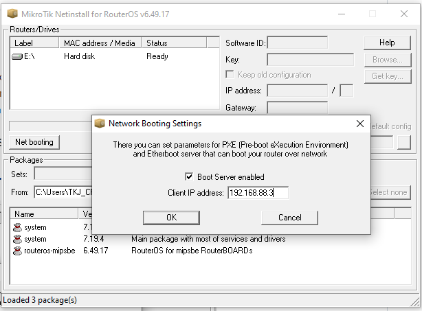
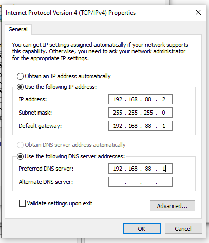
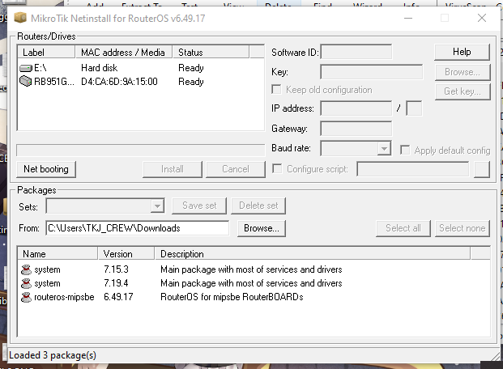
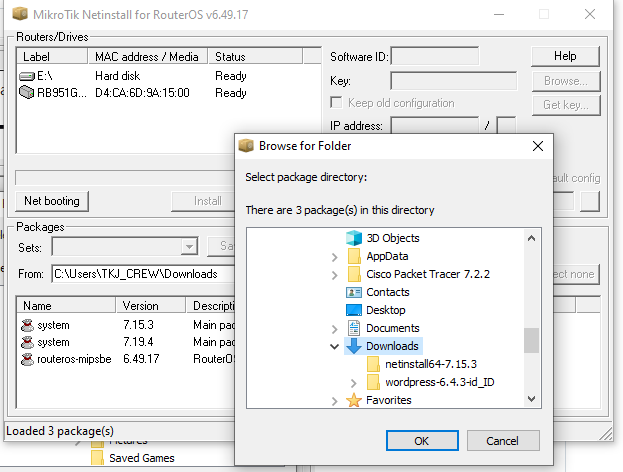
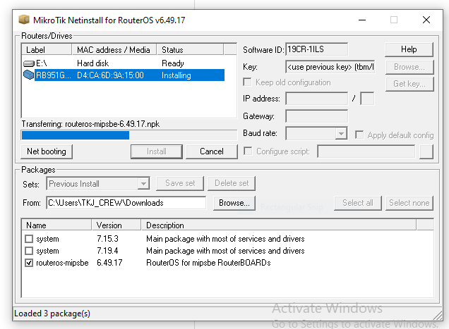
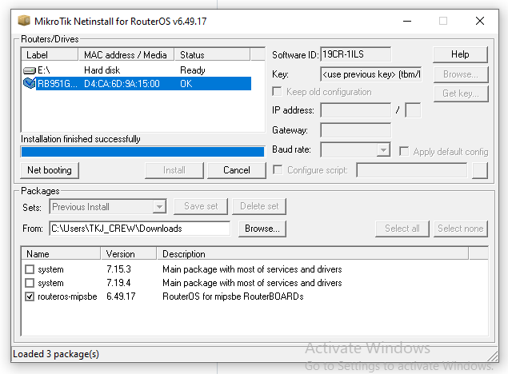

# LAB-13-Netinstall-instal-ulang-Router-OS
tanggal 14 agustus 2025 

Netinstall adalah program yang  memungkinkan bagi anda untuk menginstall MikroTik Router OS ke PC  
atau ke sebuah RouterBoard melalui jaringan Ethernet. Netinstall juga bisa digunakan untuk menginstall  
ulang Router OS yang memiliki masalah seperti gagal dalam mengupgrade atau menginstal ulang,    
atau lupa username dan password karena anda memberikan kombinasi yang sangat strong.    

# Langkah – Langkah Instalasi
   1. mendownload Firmware dan Software Netinstallnya
      bisa di download di website resmi Mikrotik. https://mikrotik.com/download  
      Pastikan Jenis firmware yang Anda dowload sesuai dengan spesifikasi Router Anda.  
  2. Extract terlebih dahulu file  zip nya dan buka aplikasinya.
  3. Klik netbooting lalu setting ip private dan centang boot server enabled    

  4. Setting IP Private pada laptop anda yang masih satu segment dengan IP yang ada pada netinstall  

  5. Sambungkan kabel UTP ke laptop dan ether 1 pada mikroti  
  6. Sambil menekan tombol reset sambungkan mikrotik dengan power.  
     Ingat tekan terlebih dahulu tombol reset setelah itu baru sambungkan dengan power.  
  7. Jangan lepaskan tombol reset hingga mikrotik terdetect pada netinstall (lihat pada gambar). Sekitar 25-35 detik  

  8. Klik Browse lalu pilih folder tempat anda menyimpan firmware yang sudah di download sebelumnya  

 
  9. Klik Install, dan tunggu sampai proses selesai

  10. jika susah selesai, silakan coba remote kembali mikrotik anda.  

# kesimpulan 
Netinstall adalah solusi terakhir untuk memperbaiki, menginstal ulang,  
atau memulihkan router MikroTik yang bermasalah,  
langsung melalui jaringan menggunakan PC dan aplikasi Netinstall.  
